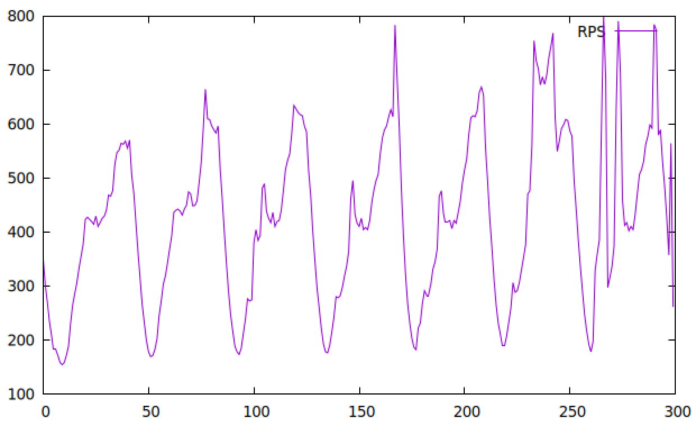

## Trace-Driven Load Generation (Twitter Cache Trace)

The open-loop load generator has been extended to replay real-world datacenter
traffic traces as the request rate schedule, replacing the fixed `-R` rate with
a dynamically varying one derived from a CSV trace file.

### Motivation

Real workloads follow diurnal patterns and exhibit sudden spikes that a constant
RPS cannot capture. The [Twitter cache trace](https://github.com/twitter/cache-trace)
(`cluster10.rps.txt`) provides 7 days of per-second request rates observed on a
production cache cluster. Because experiments can only run for a few hours, the
trace is **time-compressed**: the full trace is divided into exactly `-d` buckets
and each bucket's rows are averaged into one RPS value, preserving the relative
shape of the diurnal cycle and spikes at a reduced timescale.

### New Parameters

| Flag | Description |
|---|---|
| `-f <file>` / `--trace` | Path to a `timestamp,rps` CSV file. The trace is automatically scaled to fit the experiment duration specified with `-d`. |
| `-M <N>` / `--maxrps` | Rescale the compressed schedule so its peak equals `N` req/s. All relative proportions (troughs, peaks, spikes) are preserved — only the absolute magnitude changes. Useful for targeting a known server capacity. |
| `-S` / `--print-schedule` | Dry-run mode: print the full computed RPS schedule (one `second rps` line per experiment second) and exit without generating any load. Use this to verify the shape of the schedule before committing to a full run. |

### How It Works

1. At startup, `load_and_scale_trace()` reads the CSV, computes a compression
   factor of `trace_length / duration_s`, and averages each window of trace rows
   into one slot of `rps_schedule[]`.
2. If `--maxrps` is set, every slot is rescaled proportionally so the peak
   equals the target.
3. After the 10-second calibration phase, an `aeCreateTimeEvent` timer fires
   every second. It looks up `rps_schedule[elapsed_s]`, divides by the number of
   threads, and updates `c->interval` (the inter-arrival time in µs) on every
   connection in the thread. When the rate increases, `thread_next` is reset to
   `now` to prevent a catch-up burst.
4. The live rate is printed to stdout each second (thread 0 only):
   `[trace  42s / 3600s]  target RPS: 1247`

### Example Usage

```bash
# Verify the schedule before running (dry run)
./wrk_open_loop -f cluster10.rps.txt -d 3600s -M 2000 -S | head -20

# Full experiment: compress 7-day trace into 1 hour, peak at 2000 RPS
./wrk_open_loop -D exp -t 4 -c 400 -d 3600s -L \
  -f cluster10.rps.txt -M 2000 \
  -s ./wrk2/scripts/hotel-reservation/mixed-workload_type_1.lua \
  http://<frontend>:5000

./wrk --trace=cluster10.rps.txt --duration=600s --maxrps=800 -S -s wrk/scrips http://10.10.10.1 | gnuplot -p -e "plot '-' with lines title 'RPS'"
```


